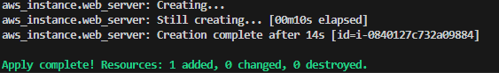
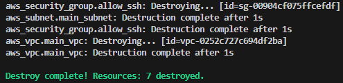

# 🚀 AWS Infrastructure as Code (IaC) - Hello World

Este projeto é uma implementação prática de **Infrastructure as Code (IaC)** utilizando **Terraform** e **AWS**. O objetivo foi automatizar o provisionamento de recursos de nuvem, garantindo um ambiente versionável, consistente e idempotente.

## 🏗️ O que foi construído
* **VPC & Subnet**: Rede isolada para a aplicação.
* **Internet Gateway**: Rota para permitir acesso externo (Internet).
* **Security Group**: Firewall configurado com a porta 22 (SSH) aberta.
* **EC2 Instance**: Servidor provisionado utilizando Amazon Linux 2023 (Free-tier).

## 🛠️ Pré-requisitos
* [Terraform](https://www.terraform.io/) instalado (v1.0 ou superior).
* [AWS CLI](https://aws.amazon.com/pt/cli/) configurado localmente (`aws configure`).

## 🚀 Como executar
No seu terminal, dentro da pasta do projeto:

```bash
# 1. Inicializa o ambiente e baixa os plugins
terraform init

# 2. Visualiza o plano de execução
terraform plan

# 3. Aplica as mudanças na AWS
terraform apply

# 4. (Ao finalizar) Destrói a infraestrutura para evitar custos
terraform destroy
```





